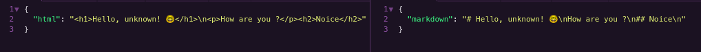

<h1 align="center">MD-It</h1>
<p align="center">A simple API to transform HTML into MarkDown.</p>

<br/>



### Stack

- [TypeScript](https://www.typescriptlang.org/)
- [Axios](https://axios-http.com/docs/intro)
- [JSDom](https://www.npmjs.com/package/jsdom)
- [Express](https://expressjs.com/)
- [ESLint](https://eslint.org/)

### How to use

After download, install the dependencies:

```
yarn --prod
# or
npm i --prod
```

And run the NodeJS app:

```
yarn start
# or
npm run start
```

### Request

You can just use the POST method, and pass these parameters in body:

- `html`: the HTML content.
- `url`: the URL to get the HTML.

### Development

If you want to edit this code, install the development dependencies:

```
yarn
# or
npm i
```

The commands you will use are:

- `dev`: to run `ts-node-dev`.
- `build`: to transpile the TypeScript files.
- `clean`: to remove all JavaScript files.
- `check-code`: to run ESLint.
- `fix`: to ESLint fix the errors found.

<br>

Good luck! 🤓
